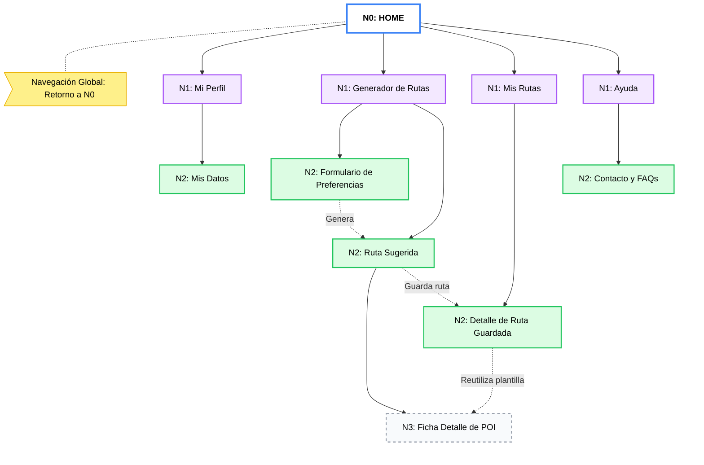

```mermaid
graph TD
    classDef n0 fill:#ffffff,stroke:#3b82f6,stroke-width:3px,font-weight:bold,color:#000
    classDef n1 fill:#f3e8ff,stroke:#a855f7,stroke-width:2px,color:#000
    classDef n2 fill:#dcfce3,stroke:#22c55e,stroke-width:2px,color:#000
    classDef n3 fill:#f8fafc,stroke:#9ca3af,stroke-width:2px,stroke-dasharray: 5 5,color:#000
    classDef nota fill:#fef08a,stroke:#eab308,stroke-width:1px,color:#000

    N0["N0: HOME"]:::n0
    GlobalNav>Navegación Global: Retorno a N0]:::nota
    N0 -.- GlobalNav

    %% HACK: ENVOLVER EN CAJAS INVISIBLES PARA FORZAR ALINEACIÓN HORIZONTAL
    subgraph Nivel_1 [" "]
        N1_1["N1: Mi Perfil"]:::n1
        N1_2["N1: Generador de Rutas"]:::n1
        N1_3["N1: Mis Rutas"]:::n1
        N1_4["N1: Ayuda"]:::n1
    end

    subgraph Nivel_2 [" "]
        N2_1["N2: Mis Datos"]:::n2
        N2_3["N2: Formulario de Preferencias"]:::n2
        N2_4["N2: Ruta Sugerida"]:::n2
        N2_5["N2: Detalle de Ruta Guardada"]:::n2
        N2_7["N2: Contacto y FAQs"]:::n2
    end

    subgraph Nivel_3 [" "]
        N3_1["N3: Ficha Detalle de POI"]:::n3
    end

    %% Conexiones verticales
    N0 --> N1_1 & N1_2 & N1_3 & N1_4
    N1_1 --> N2_1
    N1_2 --> N2_3 & N2_4
    N1_3 --> N2_5
    N1_4 --> N2_7
    N2_4 --> N3_1

    %% Conexiones transversales (ahora no romperán el layout)
    N2_3 -.->|"Genera"| N2_4
    N2_4 -.->|"Guarda ruta"| N2_5
    N2_5 -.->|"Reutiliza plantilla"| N3_1

    %% Ocultamos los bordes de los subgrafos
    style Nivel_1 fill:none,stroke:none,color:transparent
    style Nivel_2 fill:none,stroke:none,color:transparent
    style Nivel_3 fill:none,stroke:none,color:transparent
```