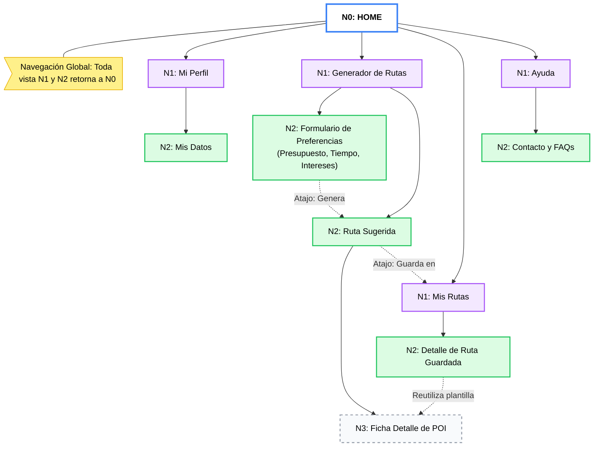

```mermaid
graph TD
    classDef n0 fill:#ffffff,stroke:#3b82f6,stroke-width:3px,font-weight:bold,color:#000
    classDef n1 fill:#f3e8ff,stroke:#a855f7,stroke-width:2px,color:#000
    classDef n2 fill:#dcfce3,stroke:#22c55e,stroke-width:2px,color:#000
    classDef n3 fill:#f8fafc,stroke:#9ca3af,stroke-width:2px,stroke-dasharray: 5 5,color:#000
    classDef nota fill:#fef08a,stroke:#eab308,stroke-width:1px,color:#000

    N0["N0: HOME"]:::n0
    GlobalNav>Navegación Global: Toda vista N1 y N2 retorna a N0]:::nota
    
    N0 --- GlobalNav

    N0 --> N1_1["N1: Mi Perfil"]:::n1
    N0 --> N1_2["N1: Generador de Rutas"]:::n1
    N0 --> N1_3["N1: Mis Rutas"]:::n1
    N0 --> N1_4["N1: Ayuda"]:::n1

    %% Rama Mi Perfil
    N1_1 --> N2_1["N2: Mis Datos"]:::n2

    %% Rama Generador (Formulario consolidado en N2)
    N1_2 --> N2_3["N2: Formulario de Preferencias<br>(Presupuesto, Tiempo, Intereses)"]:::n2
    N1_2 --> N2_4["N2: Ruta Sugerida"]:::n2
    
    %% N3 dinámico
    N2_4 --> N3_1["N3: Ficha Detalle de POI"]:::n3

    %% Rama Mis Rutas (Plantilla en lugar de instancia)
    N1_3 --> N2_5["N2: Detalle de Ruta Guardada"]:::n2
    
    %% Rama Ayuda
    N1_4 --> N2_7["N2: Contacto y FAQs"]:::n2

    %% Enlaces transversales de navegación
    N2_3 -.->|"Atajo: Genera"| N2_4
    N2_4 -.->|"Atajo: Guarda en"| N1_3
    N2_5 -.->|"Reutiliza plantilla"| N3_1

```