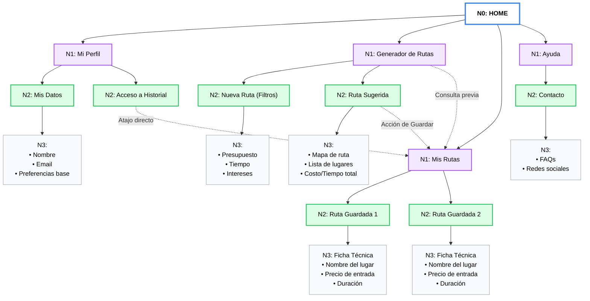

```mermaid
graph TD
    %% Definición de estilos jerárquicos basados en la imagen
    classDef n0 fill:#ffffff,stroke:#3b82f6,stroke-width:3px,font-weight:bold,color:#000
    classDef n1 fill:#f3e8ff,stroke:#a855f7,stroke-width:2px,color:#000
    classDef n2 fill:#dcfce3,stroke:#22c55e,stroke-width:2px,color:#000
    classDef n3 fill:#f8fafc,stroke:#9ca3af,stroke-width:1px,color:#000

    %% N0: Raíz
    N0["N0: HOME"]:::n0

    %% N1: Secciones Principales
    N0 --> N1_1["N1: Mi Perfil"]:::n1
    N0 --> N1_2["N1: Generador de Rutas"]:::n1
    N0 --> N1_3["N1: Mis Rutas"]:::n1
    N0 --> N1_4["N1: Ayuda"]:::n1

    %% Rama Mi Perfil
    N1_1 --> N2_1["N2: Mis Datos"]:::n2
    N1_1 --> N2_2["N2: Acceso a Historial"]:::n2
    
    N2_1 --> N3_1["N3:<br/>• Nombre<br/>• Email<br/>• Preferencias base"]:::n3

    %% Rama Generador de Rutas
    N1_2 --> N2_3["N2: Nueva Ruta (Filtros)"]:::n2
    N1_2 --> N2_4["N2: Ruta Sugerida"]:::n2
    
    N2_3 --> N3_2["N3:<br/>• Presupuesto<br/>• Tiempo<br/>• Intereses"]:::n3
    N2_4 --> N3_3["N3:<br/>• Mapa de ruta<br/>• Lista de lugares<br/>• Costo/Tiempo total"]:::n3

    %% Rama Mis Rutas
    N1_3 --> N2_5["N2: Ruta Guardada 1"]:::n2
    N1_3 --> N2_6["N2: Ruta Guardada 2"]:::n2
    
    N2_5 --> N3_4["N3: Ficha Técnica<br/>• Nombre del lugar<br/>• Precio de entrada<br/>• Duración"]:::n3
    N2_6 --> N3_5["N3: Ficha Técnica<br/>• Nombre del lugar<br/>• Precio de entrada<br/>• Duración"]:::n3

    %% Rama Ayuda
    N1_4 --> N2_7["N2: Contacto"]:::n2
    N2_7 --> N3_6["N3:<br/>• FAQs<br/>• Redes sociales"]:::n3

    %% ENLACES TRANSVERSALES
    N2_2 -.->|"Atajo directo"| N1_3
    N2_4 -.->|"Acción de Guardar"| N1_3
    N1_2 -.->|"Consulta previa"| N1_3

```