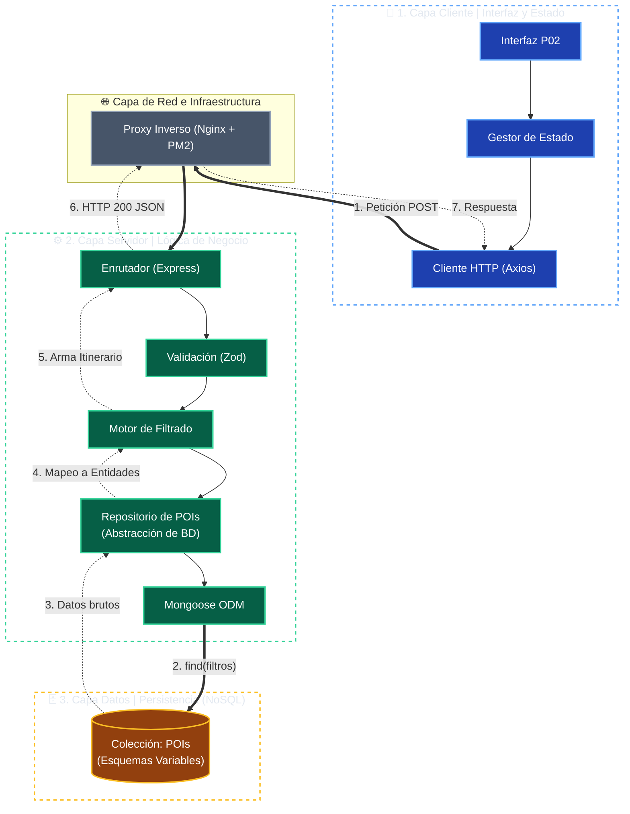

```mermaid
graph TD
    classDef cliente fill:#1e40af,stroke:#60a5fa,stroke-width:2px,color:#fff
    classDef server fill:#065f46,stroke:#34d399,stroke-width:2px,color:#fff
    classDef bd fill:#92400e,stroke:#fbbf24,stroke-width:2px,color:#fff
    classDef infra fill:#475569,stroke:#94a3b8,stroke-width:2px,color:#fff

    subgraph CapaInfra ["🌐 Capa de Red e Infraestructura"]
        Nginx["Proxy Inverso (Nginx + PM2)"]:::infra
    end

    subgraph CapaCliente ["📱 1. Capa Cliente | Interfaz y Estado"]
        UI["Interfaz P02"]:::cliente
        State["Gestor de Estado"]:::cliente
        HTTP["Cliente HTTP (Axios)"]:::cliente
        UI --> State --> HTTP
    end

    subgraph CapaServer ["⚙️ 2. Capa Servidor | Lógica de Negocio"]
        Router["Enrutador (Express)"]:::server
        Validator["Validación (Zod)"]:::server
        Controller["Motor de Filtrado"]:::server
        Repo["Repositorio de POIs<br>(Abstracción de BD)"]:::server
        ODM["Mongoose ODM"]:::server

        Router --> Validator --> Controller --> Repo --> ODM
    end

    subgraph CapaDatos ["🗄️ 3. Capa Datos | Persistencia (NoSQL)"]
        CollPOI[("Colección: POIs<br>(Esquemas Variables)")]:::bd
    end

    %% Flujo Integrado
    HTTP == "1. Petición POST" ==> Nginx
    Nginx ==> Router
    ODM == "2. find(filtros)" ==> CollPOI
    
    CollPOI -. "3. Datos brutos" .-> Repo
    Repo -. "4. Mapeo a Entidades" .-> Controller
    Controller -. "5. Arma Itinerario" .-> Router
    Router -. "6. HTTP 200 JSON" .-> Nginx
    Nginx -. "7. Respuesta" .-> HTTP

    style CapaCliente fill:none,stroke:#60a5fa,stroke-width:2px,stroke-dasharray: 5 5,color:#e2e8f0
    style CapaServer fill:none,stroke:#34d399,stroke-width:2px,stroke-dasharray: 5 5,color:#e2e8f0
    style CapaDatos fill:none,stroke:#fbbf24,stroke-width:2px,stroke-dasharray: 5 5,color:#e2e8f0
```
