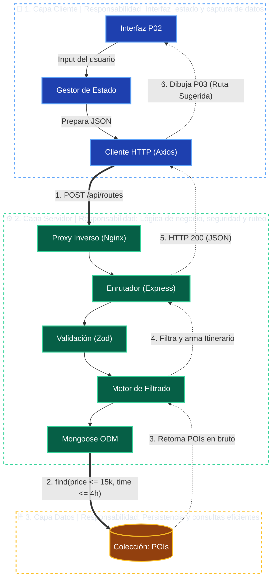

```mermaid
graph TD
    classDef cliente fill:#1e40af,stroke:#60a5fa,stroke-width:2px,color:#fff
    classDef server fill:#065f46,stroke:#34d399,stroke-width:2px,color:#fff
    classDef bd fill:#92400e,stroke:#fbbf24,stroke-width:2px,color:#fff

    subgraph CapaCliente ["📱 1. Capa Cliente | Responsabilidad: Interfaz, estado y captura de datos"]
        UI["Interfaz P02"]:::cliente
        State["Gestor de Estado"]:::cliente
        HTTP["Cliente HTTP (Axios)"]:::cliente
        UI -->|Input del usuario| State
        State -->|Prepara JSON| HTTP
    end

    subgraph CapaServer ["⚙️ 2. Capa Servidor | Responsabilidad: Lógica de negocio, seguridad y ruteo"]
        Nginx["Proxy Inverso (Nginx)"]:::server
        Router["Enrutador (Express)"]:::server
        Validator["Validación (Zod)"]:::server
        Controller["Motor de Filtrado"]:::server
        ODM["Mongoose ODM"]:::server

        Nginx --> Router
        Router --> Validator
        Validator --> Controller
        Controller --> ODM
    end

    subgraph CapaDatos ["🗄️ 3. Capa Datos | Responsabilidad: Persistencia y consultas eficientes"]
        CollPOI[("Colección: POIs")]:::bd
    end

    %% Recorrido del caso de uso (Ida)
    HTTP == "1. POST /api/routes" ==> Nginx
    ODM == "2. find(price <= 15k, time <= 4h)" ==> CollPOI

    %% Recorrido del caso de uso (Vuelta)
    CollPOI -. "3. Retorna POIs en bruto" .-> Controller
    Controller -. "4. Filtra y arma Itinerario" .-> Router
    Router -. "5. HTTP 200 (JSON)" .-> HTTP
    HTTP -. "6. Dibuja P03 (Ruta Sugerida)" .-> UI

    %% Estilos invisibles
    style CapaCliente fill:none,stroke:#60a5fa,stroke-width:2px,stroke-dasharray: 5 5,color:#e2e8f0
    style CapaServer fill:none,stroke:#34d399,stroke-width:2px,stroke-dasharray: 5 5,color:#e2e8f0

    style CapaDatos fill:none,stroke:#fbbf24,stroke-width:2px,stroke-dasharray: 5 5,color:#e2e8f0
    
```
