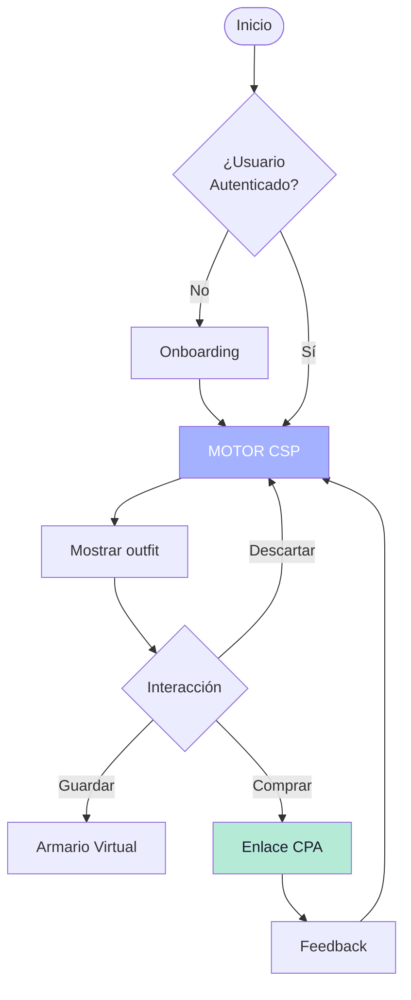

<div align="center">

# StyleSync

### Motor de Recomendación Prescriptiva para E-Commerce de Vestuario Masculino


---

**Stack Tecnológico - Hito 1 y 2**

[](https://reactnative.dev/)
[](https://expo.dev/)
[](https://nodejs.org/)
[](https://zustand-demo.pmnd.rs/)
[](https://www.nativewind.dev/)
[](https://vitejs.dev/)
[](https://www.framer.com/motion/)

---

**Normativas de Cumplimiento**

[](https://www.iso.org/standard/63500.html)
[](https://www.w3.org/WAI/WCAG21/quickref/)

---

**Ingeniería Civil en Informática - Universidad Mayor**

</div>

---

## Tabla de Contenidos

1. [Visión General del Proyecto](#visión-general-del-proyecto)
2. [Estructura del Repositorio](#estructura-del-repositorio)
3. [Landing Page (Web Marketing)](#landing-page-web-marketing)
4. [Problemática y Contexto](#problemática-y-contexto)
5. [Solución Arquitectural](#solución-arquitectural)
6. [Equipo de Desarrollo](#equipo-de-desarrollo)
7. [Stack Tecnológico](#stack-tecnológico)
8. [Motor CSP](#motor-de-satisfacción-de-restricciones-csp)
9. [Modelo de Negocios](#modelo-de-negocios)
10. [Diagrama de Flujo](#diagrama-de-flujo)
11. [Normativas y Estándares](#normativas-y-estándares)
12. [Instalación y Desarrollo](#instalación-y-desarrollo)

---

## Visión General del Proyecto

StyleSync es un **motor de recomendación prescriptiva** que resuelve el problema de selección de vestuario masculino mediante algoritmos de **Satisfacción de Restricciones (CSP)** y análisis de **colorimetría HSV**.

El sistema opera en dos frentes:

- **B2C**: App móvil que ayuda a hombres de 25-45 años a optimizar su armario y eliminar la parálisis de decisión.
- **B2B**: API e insights de datos para e-commerce que reducen devoluciones y aumentan la conversión.

---

## Estructura del Repositorio

```
StyleSync/
├── README.md                    # Documentación principal del proyecto
├── landing/                     # Landing Page marketing (React + Vite)
│   ├── src/
│   │   ├── components/
│   │   │   ├── Navbar.jsx       # Navegación fija glassmorphism
│   │   │   ├── Hero.jsx         # Hero con mockup 3D flotante
│   │   │   ├── UserPainSection.jsx  # Tarjetas de dolor del usuario
│   │   │   ├── SolutionSection.jsx  # Solución en zigzag
│   │   │   ├── CommunitySection.jsx # Sección de comunidad
│   │   │   ├── CTASection.jsx   # Call to Action final
│   │   │   └── Footer.jsx       # Footer con normativas
│   │   ├── App.jsx              # Componente raíz
│   │   ├── main.jsx             # Entry point
│   │   └── index.css            # Estilos globales + Tailwind
│   ├── package.json
│   ├── vite.config.js           # Configuración Vite + Tailwind
│   └── index.html
│
└── docs/                        # (Próximamente) Documentación técnica
    ├── 01-producto/
    ├── 02-arquitectura/
    └── 03-algoritmo/
```

---

## Landing Page (Web Marketing)

### Características

| Característica | Descripción |
|:---------------|:------------|
| **Framework** | React 19 + Vite |
| **Estilos** | Tailwind CSS v4 |
| **Animaciones** | Framer Motion |
| **Diseño** | Glassmorphism avanzado |
| **Responsivo** | Mobile First |
| **Accesible** | WCAG 2.1 AA (ISO/IEC 40500) |

### Secciones de la Landing

| Sección | Objetivo |
|:--------|:---------|
| **Hero** | Título "Vístete con lógica. Despídete del estrés." + mockup 3D |
| **El Problema** | 3 tarjetas de cristal: Estrés (84%), Clóset inactivo (80%), Inseguridad (73%) |
| **La Solución** | Zigzag: Clóset Virtual, Comunidad Pragmática, Compras Inteligentes |
| **Comunidad** | Stats + feed de outfits de usuarios reales |
| **CTA Final** | Banner lavanda con descarga App Store / Google Play |

### Para ejecutar la Landing

```bash
cd landing
npm install
npm run dev
```

La landing estará disponible en `http://localhost:5173`

### Stack de la Landing

| Tecnología | Propósito |
|:-----------|:----------|
| React 19 | Framework UI |
| Vite | Build tool y dev server |
| Tailwind CSS v4 | Utility-first CSS |
| Framer Motion | Animaciones al scroll |

---

## Problemática y Contexto

### Problema del Usuario Final (B2C)

| Dato | Impacto |
|:-----|:--------|
| **84%** sufren estrés al elegir qué ponerse cada mañana |
| **80%** del clóset está inactivo (solo usas el 20% de tu ropa) |
| **73%** tienen dudas frecuentes que afectan su confianza |

### Problema de la Industria (B2B)

| Dato | Impacto |
|:-----|:--------|
| **55%** de usuarios hacen bracketing (compran 3 tallas, devuelven 2) |
| **40%** del valor comercial se pierde en logística inversa |
| **77%** de devoluciones ocurren por problemas de ajuste |

### Público Objetivo

**Hombres de 25-45 años** pragmáticos que buscan eficiencia en su rutina diaria y confianza al vestirse.

---

## Solución Arquitectural

### Armario Cápsula Canónico (45 Prendas)

```
Distribución del Catálogo
├── FORMAL (15 prendas)
├── BUSINESS CASUAL (15 prendas)
└── CASUAL (15 prendas)
```

### Motor CSP + Colorimetría HSV

1. **Fit Score Probabilístico**: Calcula la probabilidad de ajuste perfecto
2. **Colorimetría HSV**: Analiza Matiz, Saturación y Valor para armonía cromática
3. **Aserción de Compra**: Recomendación con certeza matemática (elimina bracketing)

---

## Equipo de Desarrollo

| Miembro | Rol | Responsabilidades |
|:--------|:----|:------------------|
| **Francisco Carvajal** | UI/UX & Frontend | Diseño de interfaces, accesibilidad, componentes visuales |
| **Gerzon Toro** | Frontend Logic | Lógica de negocio, gestión de estado, optimización |
| **Francisco Carrera** | Full-Stack & Backend | Arquitectura, API REST, motor CSP, base de datos |

---

## Stack Tecnológico

### App Móvil (React Native + Expo)

| Tecnología | Propósito |
|:-----------|:----------|
| React Native 0.74+ | Desarrollo multiplataforma |
| Expo SDK 51 | Build system y herramientas |
| Zustand | Gestión de estado |
| NativeWind | Tailwind para React Native |
| Expo Router | Navegación basada en archivos |

### Backend (Node.js)

| Tecnología | Propósito |
|:-----------|:----------|
| Node.js LTS | Runtime del servidor |
| REST (OpenAPI 3.0) | API communicación |
| PostgreSQL | Base de datos principal |
| Redis | Cache de resultados CSP |

### Landing Page (Web)

| Tecnología | Propósito |
|:-----------|:----------|
| React 19 | Framework UI |
| Vite | Build tool |
| Tailwind CSS v4 | Estilos |
| Framer Motion | Animaciones |

---

## Motor de Satisfacción de Restricciones (CSP)

### Definición Formal

```
CSP = (X, D, C)

X = {x₁, x₂, ..., xₙ}  → Variables (prendas)
D = {D₁, D₂, ..., Dₙ}   → Dominios de cada variable
C = {c₁, c₂, ..., cₘ}    → Restricciones de compatibilidad
```

### Restricciones Implementadas

| ID | Restricción | Descripción |
|:---|:------------|:------------|
| RC-01 | Colorimetría HSV | ΔE ≤ umbral de armonía cromática |
| RC-02 | Formalidad | Nivel ∈ contexto del evento |
| RC-03 | Talla | Talla_prenda = Talla_usuario ± tolerancia |
| RC-04 | Temporada | Temperatura ∈ rango_prenda |
| RC-05 | Estilo | Perfil_usuario ∩ estilo_prenda ≠ ∅ |

---

## Modelo de Negocios

### B2C - Afiliación Prescriptiva (CPA)

1. Usuario completa perfil CSP
2. Sistema detecta "vacíos" en armario cápsula
3. Inyecta enlace de compra CPA para prenda faltante
4. Comisión por conversión exitosa (5-15%)

### B2B - Data Insights

- Tendencias de colores por región/demografía
- Patrones de compra estacionales
- Correlación talla-formalidad-preferencia
- Widget de estilismo para e-commerce (+20% conversión, +40% ticket promedio)

---

## Diagrama de Flujo



---

## Normativas y Estándares

| Normativa | Alcance | Estado |
|:----------|:--------|:-------|
| **ISO 9241** | Usabilidad de la interfaz | ✅ Cumple |
| **ISO/IEC 40500** | Accesibilidad web (WCAG 2.1 AA) | ✅ Cumple |
| **RGPD** | Protección de datos personales | ✅ Cumple |
| **CCPA** | Privacidad de datos biométricos | ✅ Cumple |

---

## Instalación y Desarrollo

### Requisitos Previos

```bash
Node.js >= 18.0.0
npm >= 9.0.0
```

### Ejecutar Landing Page

```bash
cd landing
npm install
npm run dev
```

### Comandos Disponibles

| Comando | Descripción |
|:--------|:------------|
| `npm run dev` | Iniciar servidor de desarrollo |
| `npm run build` | Generar build de producción |
| `npm run preview` | Vista previa del build |
| `npm run lint` | Ejecutar linter |

---

<div align="center">

### Proyecto de Título - Ingeniería Civil en Informática

**Universidad Mayor**

**Equipo StyleSync - 2026**

---

*Motor de Recomendación Prescriptiva basado en CSP y Colorimetría HSV*

</div>