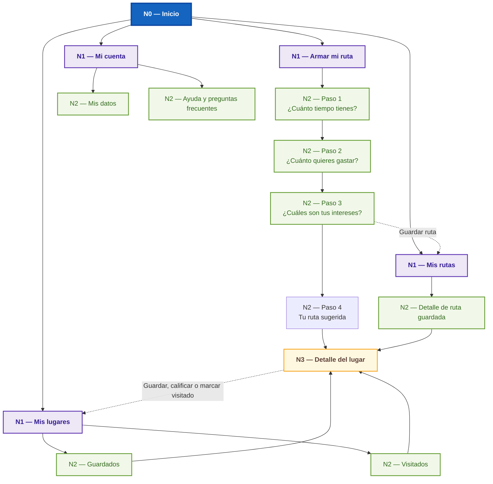

```mermaid
flowchart TD
    INICIO["<b>N0 — Inicio</b>"]

    INICIO --> ARMAR["<b>N1 — Armar mi ruta</b>"]
    INICIO --> MISRUTAS["<b>N1 — Mis rutas</b>"]
    INICIO --> MISLUGARES["<b>N1 — Mis lugares</b>"]
    INICIO --> CUENTA["<b>N1 — Mi cuenta</b>"]

    ARMAR --> P1["N2 — Paso 1<br/>¿Cuánto tiempo tienes?"]
    P1 --> P2["N2 — Paso 2<br/>¿Cuánto quieres gastar?"]
    P2 --> P3["N2 — Paso 3<br/>¿Cuáles son tus intereses?"]
    P3 --> P4["N2 — Paso 4<br/>Tu ruta sugerida"]
    P4 --> LUGAR["<b>N3 — Detalle del lugar</b>"]

    MISRUTAS --> RUTAGUARDADA["N2 — Detalle de ruta guardada"]
    RUTAGUARDADA --> LUGAR

    MISLUGARES --> GUARDADOS["N2 — Guardados"]
    MISLUGARES --> VISITADOS["N2 — Visitados"]
    GUARDADOS --> LUGAR
    VISITADOS --> LUGAR

    CUENTA --> DATOS["N2 — Mis datos"]
    CUENTA --> AYUDA["N2 — Ayuda y preguntas frecuentes"]

    P3 -. "Guardar ruta" .-> MISRUTAS
    LUGAR -. "Guardar, calificar o marcar visitado" .-> MISLUGARES

    classDef n0 fill:#1565c0,stroke:#0d47a1,stroke-width:3px,color:#ffffff
    classDef n1 fill:#ede7f6,stroke:#5e35b1,stroke-width:2px,color:#311b92
    classDef n2 fill:#f1f8e9,stroke:#689f38,stroke-width:2px,color:#33691e
    classDef n3 fill:#fff8e1,stroke:#f9a825,stroke-width:2px,color:#5d4037

    class INICIO n0
    class ARMAR,MISRUTAS,MISLUGARES,CUENTA n1
    class P1,P2,P3,RUTAGUARDADA,GUARDADOS,VISITADOS,DATOS,AYUDA n2
    class LUGAR n3
```
> **Leyenda de niveles por color:** 🔵 **N0 azul** = Inicio · 🟣 **N1 lila** = Secciones principales · 🟢 **N2 verde claro** = Contenido / Pasos 1-3 · 🟡 **N3 amarillo** = Detalle compartido.
