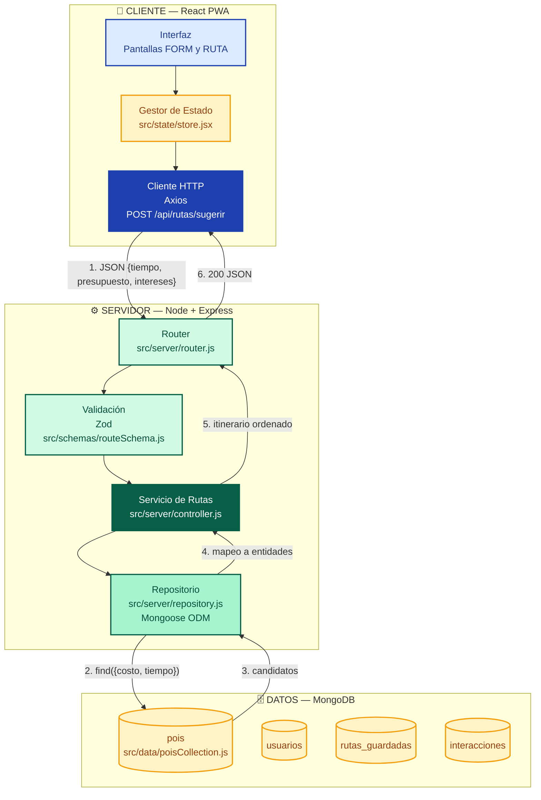

```mermaid
flowchart TD
    subgraph CLIENTE["📱 CLIENTE — React PWA"]
        UI["Interfaz<br>Pantallas FORM y RUTA"]:::ui
        ESTADO["Gestor de Estado<br>src/state/store.jsx"]:::estado
        HTTP["Cliente HTTP<br>Axios<br>POST /api/rutas/sugerir"]:::http
        UI --> ESTADO --> HTTP
    end

    subgraph SERVIDOR["⚙️ SERVIDOR — Node + Express"]
        ROUTER["Router<br>src/server/router.js"]:::pres
        ZOD["Validación<br>Zod<br>src/schemas/routeSchema.js"]:::pres
        SERV["Servicio de Rutas<br>src/server/controller.js"]:::neg
        REPO["Repositorio<br>src/server/repository.js<br>Mongoose ODM"]:::acc
        ROUTER --> ZOD --> SERV --> REPO
    end

    subgraph DATOS["🗄️ DATOS — MongoDB"]
        POIS[("pois<br>src/data/poisCollection.js")]:::bd
        USU[("usuarios")]:::bd
        RUTAS[("rutas_guardadas")]:::bd
        INTER[("interacciones")]:::bd
    end

    HTTP -- "1. JSON {tiempo, presupuesto, intereses}" --> ROUTER
    REPO -- "2. find({costo, tiempo})" --> POIS
    POIS -- "3. candidatos" --> REPO
    REPO -- "4. mapeo a entidades" --> SERV
    SERV -- "5. itinerario ordenado" --> ROUTER
    ROUTER -- "6. 200 JSON" --> HTTP

    classDef ui fill:#dbeafe,stroke:#1e40af,stroke-width:2px,color:#1e3a8a
    classDef estado fill:#fef3c7,stroke:#f59e0b,stroke-width:2px,color:#92400e
    classDef http fill:#1e40af,stroke:#1e40af,stroke-width:2px,color:#fff
    classDef pres fill:#d1fae5,stroke:#065f46,stroke-width:2px,color:#064e3b
    classDef neg fill:#065f46,stroke:#065f46,stroke-width:2px,color:#fff
    classDef acc fill:#a7f3d0,stroke:#065f46,stroke-width:2px,color:#064e3b
    classDef bd fill:#fef3c7,stroke:#f59e0b,stroke-width:2px,color:#92400e
```

