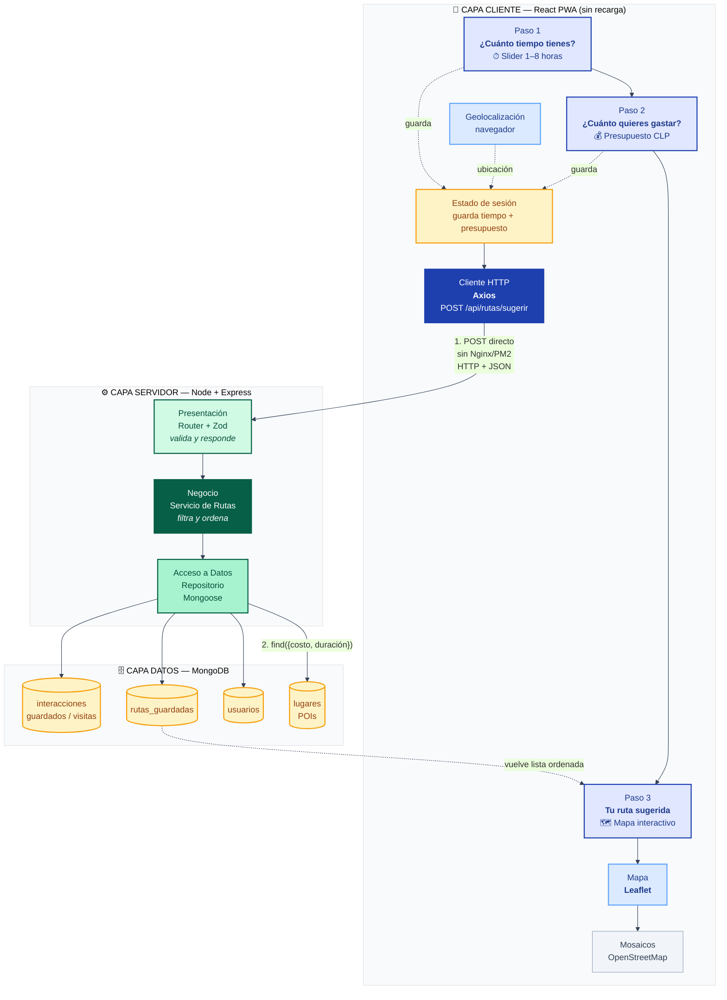

```mermaid
%%{init: {'theme':'base', 'themeVariables':{'primaryColor':'#dbeafe','primaryBorderColor':'#1e40af','lineColor':'#334155','tertiaryColor':'#f8fafc'}}}%%
flowchart TD

    subgraph CLIENTE["📱 CAPA CLIENTE — React PWA (sin recarga)"]
        direction TB
        P1["Paso 1<br><b>¿Cuánto tiempo tienes?</b><br>⏱ Slider 1–8 horas"]:::paso
        P2["Paso 2<br><b>¿Cuánto quieres gastar?</b><br>💰 Presupuesto CLP"]:::paso
        P3["Paso 3<br><b>Tu ruta sugerida</b><br>🗺️ Mapa interactivo"]:::paso
        P1 --> P2 --> P3

        ESTADO["Estado de sesión<br>guarda tiempo + presupuesto"]:::estado
        P1 -. guarda .-> ESTADO
        P2 -. guarda .-> ESTADO

        HTTP["Cliente HTTP<br><b>Axios</b><br>POST /api/rutas/sugerir"]:::http
        ESTADO --> HTTP

        MAPA["Mapa<br><b>Leaflet</b>"]:::mapa
        GPS["Geolocalización<br>navegador"]:::mapa
        P3 --> MAPA
        GPS -. ubicación .-> ESTADO
        OSM["Mosaicos<br>OpenStreetMap"]:::osm
        MAPA --> OSM
    end

    subgraph SERVIDOR["⚙️ CAPA SERVIDOR — Node + Express"]
        direction LR
        PRES["Presentación<br>Router + Zod<br><i>valida y responde</i>"]:::pres
        NEG["Negocio<br>Servicio de Rutas<br><i>filtra y ordena</i>"]:::neg
        ACC["Acceso a Datos<br>Repositorio<br>Mongoose"]:::acc
        PRES --> NEG --> ACC
    end

    subgraph DATOS["🗄️ CAPA DATOS — MongoDB"]
        direction LR
        LUGARES[("lugares<br>POIs")]:::bd
        USUARIOS[("usuarios")]:::bd
        RUTAS[("rutas_guardadas")]:::bd
        INTER[("interacciones<br>guardados / visitas")]:::bd
    end

    HTTP -- "1. POST directo<br>sin Nginx/PM2<br>HTTP + JSON" --> PRES
    ACC -- "2. find({costo, duración})" --> LUGARES
    ACC --> USUARIOS
    ACC --> RUTAS
    ACC --> INTER
    RUTAS -. "vuelve lista ordenada" .-> P3

    classDef paso fill:#e0e7ff,stroke:#1e40af,stroke-width:2px,color:#1e3a8a
    classDef estado fill:#fef3c7,stroke:#f59e0b,stroke-width:2px,color:#92400e
    classDef http fill:#1e40af,stroke:#1e40af,stroke-width:2px,color:#fff
    classDef mapa fill:#dbeafe,stroke:#60a5fa,stroke-width:2px,color:#1e3a8a
    classDef osm fill:#f1f5f9,stroke:#94a3b8,stroke-width:1px,color:#334155
    classDef pres fill:#d1fae5,stroke:#065f46,stroke-width:2px,color:#064e3b
    classDef neg fill:#065f46,stroke:#065f46,stroke-width:2px,color:#fff
    classDef acc fill:#a7f3d0,stroke:#065f46,stroke-width:2px,color:#064e3b
    classDef bd fill:#fef3c7,stroke:#f59e0b,stroke-width:2px,color:#92400e
```
> **Cómo leerlo (arriba → abajo):** Pasos 1 y 2 guardan en Estado; Paso 3 dispara POST azul directo al Servidor sin proxy; Servidor valida (Zod), filtra y vuelve al mapa.
